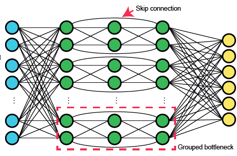
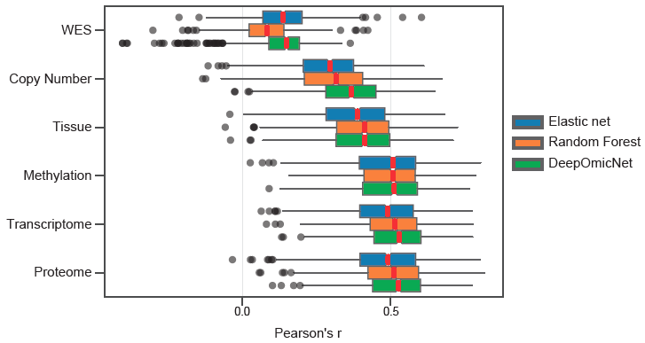

# Machine learning

This folder contains the code for the machine learning analysis, including DeepOmicNet and other machine learning models used in the benchmarking analysis.

## DeepOmicNet

DeepOmicNet uses following techniques to provide superior predictive performance than tranditional machine learning models, including elastic net and random forest, across multiple omics layers, including WES, copy number, tissue, methylation, transcriptome and proteome data.

- Skip-connection
- Grouped bottleneck
- Customised loss fuction for missing value of drug response
- State-of-the-art optimiser

`scripts/deepomicnet_model.py` - contains the core of DeepOmicNet, which is inplemented using PyTorch. `DeepOmicNetG` is the full version of DeepOmicNet, whereas `DeepOmicNet` is a simplified version that does not include the grouped bottleneck and is used for transcriptomic data for higher accuracy. Codes for training and testing are also included in this file.

## DeeProM

- Figure 4c (i)
- Figure 5a
- Figure 6a-d
- Figure S6a-c

`scripts/deepomicnet_drug.py` and `scripts/deepomicnet_crispr.py` - the launching scripts for running DeepOmicNet to predict drug response and CRISPR gene knockout effects. 

## Benchmarking

- Figure S3c

To compare DeepOmicNet with traditional machine learning models, we also used elastic net and random forest to predict drug responses and CRISPR gene knockout effects, implemented using the package scikit-learn. 

`scripts/grid_search_all_drug.py` and `scripts/grid_search_all_crispr` - launching scripts to run elastic net or random forest to predict drug responses and CRISPR gene knockout effects, respectively. The configuration is loaded from the config files under the `configs` folder. For each model, we defined a search space of hyperparameters and used grid search to maximise the preditive performance. 

## Downsampling analysis

- Figure 7a,e

`generate_downsample.py` - the sciprt used to generate random subset of proteins with bootstraping for ten times. 

`deepomicnet_downsample.py` - the lauching script to run DeepOmicNet for the downsampling analysis.