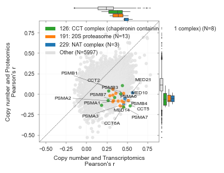

# Multiomics integration

This folder contains the code for the multiomics integration analysis, including MOFA, transcriptional 
regulation and protein biomarker discovery (linear regression models).

All scripts related with this analysis are stored in `multiomics_integration/notebooks/` and generated plots,
including all those generated for the manuscript and more, are stored in `plots/DIANN/`.

## MOFA

This makes use of MOFA ([Argelaguet et al., 2018](https://doi.org/10.15252/msb.20178124), [Argelaguet et al., 2020](https://doi.org/10.1186/s13059-020-02015-1))
to integrate multiple levels of molecular data (methylation, genomics, trancriptomics and proteomics) as well as drug response
measurements. This allows to identify factors (latent variables) that explain shared variability datasets. 

`multiomics_integration/notebooks/MultiOmicsIntegration.py` - contains the core of DeepOmicNet, which is inplemented using PyTorch. `DeepOmicNetG` is the full version of DeepOmicNet, whereas `DeepOmicNet` is a simplified version that does not include the grouped bottleneck and is used for transcriptomic data for higher accuracy. Codes for training and testing are also included in this file.

- Figure 3A, B, C and D
- Figure S2A

## Post-transcriptional regulation

- Figure 3E
- Figure S2D

Protein abundance buffering from copy number changes, similar to [Gonçalves et al., 2017](https://doi.org/10.1016/j.cels.2017.08.013), 
showing protein complexes frequently post-transcriptionally regulated.

`multiomics_integration/notebooks/ProteinAttenuation.py` 

## Protein biomarker analysis using linear regression models

Systematic linear regression models to identify protein biomarkers of drug and CRISPR response.  

- Figure 4 A and B
- Figure 5 A, B, C and D
- Figure 7 C and D
- Figure S3 D
- Figure S6 D and E

`multiomics_integration/notebooks/Associations.py` - Launch script to generate all linear regression associations

`multiomics_integration/notebooks/AssociationsOverview.py` - Drug-Protein and CRISPR-Protein associations volcano plots. 

`multiomics_integration/notebooks/TopHits.py` - Analysis of top associations and generation of qqplots.

## Protein-protein associations

All pairwise protein correlations were tested and benchmarked against existing PPI databases.

- Figure 3G
- Figure 6E
- Figure S3A

`multiomics_integration/notebooks/PPInteractions.py` - Systematic pairwise correlation of protein abundance.
